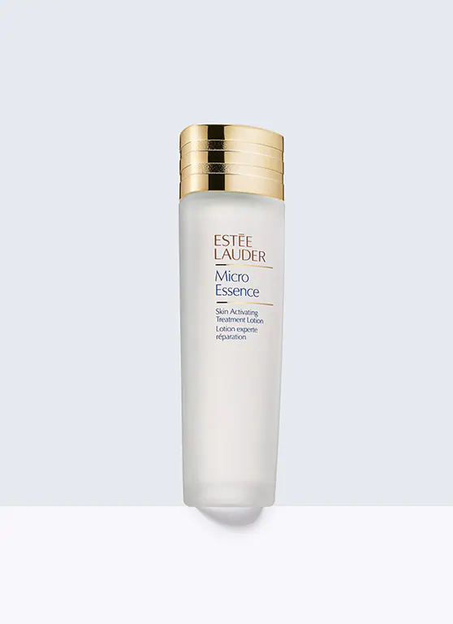
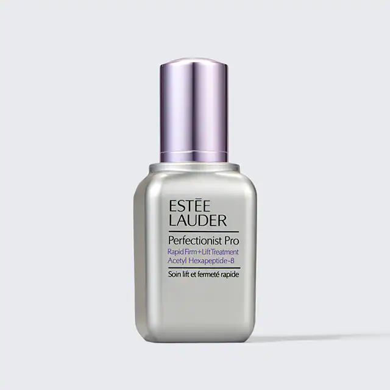
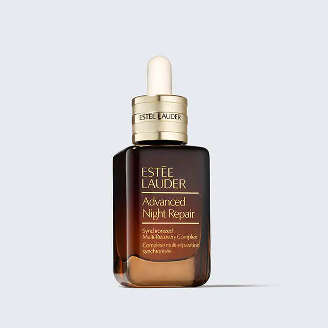

# 雅诗兰黛选购

## 清单

### 1. [活能原生液](https://www.esteelauder.com.cn/product/681/29363/product-catalog/micro-essence) [Micro Essence](https://www.esteelauder.com/product/26389/29363/product-catalog/skincare/toner-treatment-lotion/micro-essence/skin-activating-treatment-lotion)[^1][^2]

  

  精华微细渗透，源源浸润，稳定肌底，有效抚褪干纹、细纹，肌肤细致、平滑，促进肌底净澈健康，见证年轻澎弹透亮。
  
  **使用方法**

  化妆棉: 浸满微精华的化妆棉扫涂在脸上，由中心向外、向上轻抹，直至脸颊和额头。

  手: 将适量原生液滴于掌心，由下巴向中心往外，朝双颊与额头方向按压。揉搓双手直至温热，轻轻包裹住脸，帮助吸收。
  
  HOW DOES IT FIT INTO MY ROUTINE? Whether you’re a beginner or a self-proclaimed expert, this is an easy product to incorporate into your daily routine. Apply your essence after cleanser, before serum and moisturizer. The best part? It takes just seconds to apply and absorb!
  
  翻译：**怎么加入我的化妆流程？** 无论是初学者还是自认为的化妆专家，本品都很容易加入你的每日化妆流程。应该在洁面之后、serum（精华素）和moisturizer（保湿霜）之前使用。最优秀之处在于，几秒钟就可以涂好并完成吸收！
  
  **单品标价**
  
  $120/200ml ($0.60/ml, 1.67ml/$)
  
### 2. [纤雕精华](https://www.esteelauder.com.cn/product/21719/55184/perfectionist-pro) [Perfectionist Pro](https://www.esteelauder.com/product/689/55184/product-catalog/skincare/repair-serum/perfectionist-pro-serum/rapid-firm-lift-treatment-with-acetyl-hexapeptide-8)

  
  
  
  雕琢立体轮廓，年轻上扬。
  高浓度乙酰基六肽-8复合物，迅速渗透并帮助促进肌肤自身胶原蛋白、弹性蛋白的生成，全脸立体紧致上扬。
  淡化法令纹和皱纹，饱满苹果肌，上扬脸部轮廓。肌肤紧致上扬，轮廓分明，焕发活力。
  
  Redefine your skin's visible future.
  This breakthrough, fast-penetrating formula helps strengthen your skin's vital support network, for an overall more youthful, lifted look. Multiple facial zones—along the jawline, cheeks and even stubborn laugh lines—feel firmer.
  INSTANTLY: Your skin is radiant, hydrated, rejuvenated.
  3 DAYS: Your skin feels smooth, plumped, baby-soft.
  4 WEEKS: Contours feel firmer. Lines look smoother. Pores look reduced.
  With a powerful concentration of Acetyl Hexapeptide-8—a custom-designed rebuilding peptide—the formula helps skin boost its natural collagen and elastin to strengthen its vital support network for a more lifted look over time.
  
  大意：重新定义您的皮肤的可见未来。 本产品的突破性、快速渗透配方有助于加强您的皮肤的核心支持网络，整体给人更年轻、提拉性的外观。 多个面部区域，沿着颌骨，脸颊甚至顽固的微笑纹，都有更紧致的感觉。 使用后：您的皮肤有辐射，充满水分，恢复活力感。 使用3天后：你的皮肤感觉光滑，丰满，婴儿柔软。 使用4周后：皮肤轮廓感觉更紧致。线条看起来更光滑。毛孔看起来减少了。具有强大浓度的乙酰己肽-8-A定制设计的重建肽 - 该配方有助于皮肤增强其天然胶原蛋白和弹性蛋白，以加强其重要的支持网络，以便更加提升。
  
  **使用方法**

  早晚取适量涂抹于清洁后面部。
  在使用期间，搭配防晒霜并避免阳光伤害。
  

### 3. [小棕瓶精华](https://www.esteelauder.com.cn/product/14736/77491/product-catalog/anr/advanced-night-repair) [Advanced Night Repair](https://www.esteelauder.com/product/689/77491/product-catalog/skincare/repair-serum/advanced-night-repair-serum/synchronized-multi-recovery-complex)

  

[^1]: [护肤套装性价比之最雅诗兰黛黄金抗老三件套](http://xhslink.com/9vhqPf)
[^2]: [送妈妈的第一套护肤品～ 雅诗兰黛](http://xhslink.com/nnnqPf)
